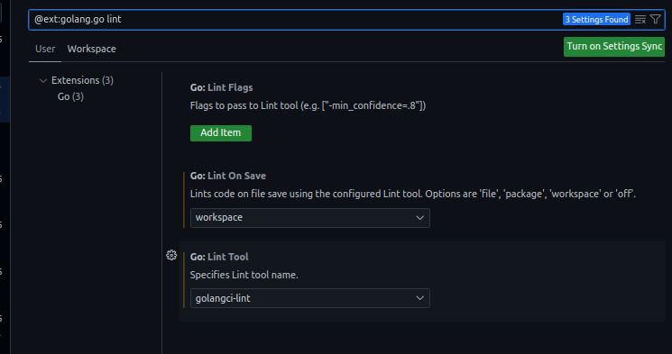

# Developer guidelines

## Developer setup

- should be using vscode
- make sure to have `git`, `make`, `taskfile` installed
- `make submodules` to populate the git submodules in the project

## Editor setup

- [vscode](https://code.visualstudio.com/)
- official golang plugin
- [golangci-lint](https://golangci-lint.run/)

### Configuring linter

- go to extensions
- choose Go
- go to extension settings


## Before committing code

- Make sure to run the perliminary checks `fmt` `lint` `cyclo` `deadcode` `spelling` `staticcheck`, using the command `make checks`
- Make sure tests pass using `make unittests`

> make unittests runs the tests in the `provider` and `pkg` directories

## Creating a pull request

- Make sure that branches development, and the story branch you're working against are updated daily.
- If you're working solo on a branch, it's your responsibility to keep that branch updated with the main story branch or development branch, can happen with rebasing `git rebase origin/development` or `git rebase origin/development_$largestorybranch`
- If you're working with other people on the same branch, you should never use rebase, always use merge e.g `git merge origin/development` or `git merge origin/development_$largestorybranch`

## Integration tests

Integration tests happen on the repository on the PRs

> To run all tests `make tests`

## Learning Go

- [Learn Go with Tests](https://quii.gitbook.io/learn-go-with-tests/)
- [Effective Go](https://go.dev/doc/effective_go)

## Code Reviews

- [CodeReview Comments](https://github.com/golang/go/wiki/CodeReviewComments)
- [Common mistakes](https://github.com/golang/go/wiki/CommonMistakes)
- Any code review guide works, recommending [uber's go guide](https://github.com/uber-go/guide)

## Generating terraform documentation

Can be generated using `make docs`

## Writing tests

Reading the [Learn Go with Tests](https://quii.gitbook.io/learn-go-with-tests/) book is a must, also prefer using the standard go testing tools in the codebase to anything else

### Given-When-Should

We should write tests in the format of `Given-When-Should` when possible, if within testify, you can use `convey`

```go

package tests

import (
    "testing"
)

func TestFunc1(t *testing.T) {
    t.Log("Given the this")
    {
        testID := 0
        t.Logf("\tTest NAME:\tWhen X")
        {
            // your testing logic here and log success or error or fatal exit when needed
            t.Logf("\t\tTest %d:\tShould happen)
        }
    }
}
```

### Setup/Teardown

for Setup and Teardown use a testing.M function

```go

package main

import (
    "fmt"
    "os"
    "testing"
)

var deps struct {
    keys string
}

func TestMain(m *testing.M) {
    setup()
    defer teardown()

    os.Exit(m.Run())
}

func setup() {
    fmt.Println("setting up")
    deps.keys = "aaaa"
}

func teardown() {
    fmt.Println("tearing down")
    deps.keys = ""
}

func TestFun1(t *testing.T) {
    fmt.Println("F1 keys: ", deps.keys)
}
func TestFun2(t *testing.T) {
    fmt.Println("F2 keys: ", deps.keys)

}

```

### Mocking

For mocking, we use [gomock](https://github.com/golang/mock)
